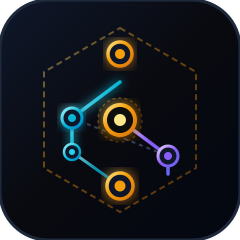
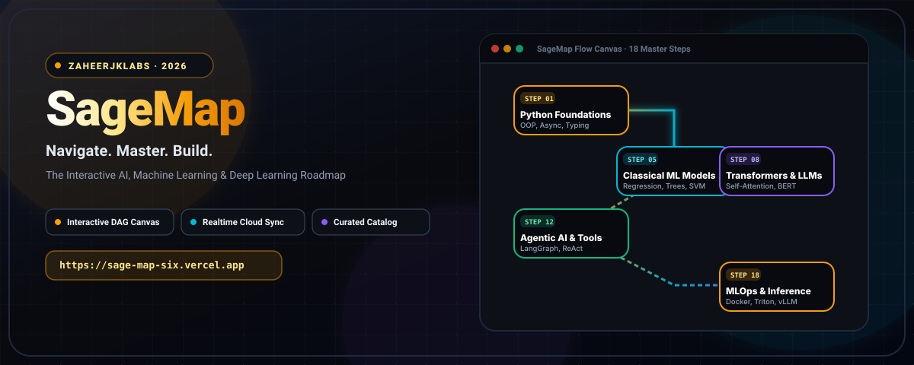

<div align="center">



# SageMap

### **Navigate. Master. Build.**

*The Interactive AI, Machine Learning & Deep Learning Roadmap & Cloud Learning Hub.*

<br/>

[](https://sage-map-six.vercel.app/)
[](https://github.com/zaheerjklabs/SageMap/releases)
[](https://react.dev/)
[](https://www.typescriptlang.org/)
[](https://vitejs.dev/)
[](https://supabase.com/)
[](./LICENSE)

[](https://tailwindcss.com/)
[](https://github.com/dagrejs/dagre)
[](https://lucide.dev/)
[](https://supabase.com/docs/guides/auth/row-level-security)
[]()

<br/>

**[Live Website](https://sage-map-six.vercel.app/) &nbsp;·&nbsp; [Roadmap Steps](#-curriculum--roadmap-steps) &nbsp;·&nbsp; [Features](#-features) &nbsp;·&nbsp; [Installation](#-installation) &nbsp;·&nbsp; [Architecture](#-architecture) &nbsp;·&nbsp; [Cloud Database](#-supabase-cloud-integration) &nbsp;·&nbsp; [License](#-license)**

<br/>



</div>

---

## 🧠 About

**SageMap** is an interactive, state-of-the-art visual roadmap and learning intelligence hub for **Artificial Intelligence**, **Machine Learning**, **Deep Learning**, **Large Language Models (LLMs)**, **Agentic Systems**, and **Production MLOps** — engineered by [**ZaheerJKLabs**](https://github.com/zaheerjklabs).

> **AI Engineering is vast. SageMap transforms the overwhelming curriculum into an intuitive, interactive graph of mastery.**

Rather than static lists or passive documents, SageMap gives you an **interactive directed graph canvas**, **curriculum matrices**, and a **curated discovery catalog** powered by real-time cloud persistence. Every step features curated courses, repositories, research papers, YouTube masterclasses, and technical interview questions designed for industry-ready engineering.

---

## ✨ Features

| | Feature | Description |
|---|---|---|
| 🗺️ | **Interactive Visual Canvas** | Infinite zoom & pan directed acyclic graph (DAG) layout with dynamic node expansion |
| 📊 | **Curriculum Matrix View** | High-density tabular knowledge matrix covering all 18 specialization steps |
| 🔍 | **Resource Discovery Explorer** | Multi-faceted catalog with instantaneous global search and tag filtering |
| ⚡ | **Supabase Realtime Cloud Sync** | Live PostgreSQL synchronization across all connected clients via Supabase Realtime |
| 🛡️ | **Admin Content Management** | Role-based authentication (`admin` / `user`) for adding, editing, and deleting resources live |
| 💡 | **Interview Q&A & System Design** | Detailed interview questions with model answer summaries and architectural takeaways |
| 📚 | **Multi-Type Curated Assets** | YouTube courses, GitHub repositories, research papers, interactive sandboxes, and books |
| 📝 | **Personal Notes & Bookmarks** | Persistent local & cloud storage for bookmarking resources and jotting topic notes |
| 🌙 | **Cyber-Dark Aesthetic** | Modern glassmorphism UI with neon accent gradients, responsive layout, and light mode support |
| 🚀 | **Zero-Flicker Architecture** | Robust state engine that prevents accidental data loss or deleted resource resurrection |

---

## 🗺️ Curriculum & Roadmap Steps

SageMap organizes modern AI engineering into 18 systematic master steps across 5 core pillars:

```
Foundations  →  Data & ML  →  Deep & GenAI  →  Agentic Systems  →  MLOps & Cloud
```

| Step | Topic | Category | Key Focus Areas & Technologies |
|---|---|---|---|
| **01** | **Python Programming** | Core Foundations | OOP, AsyncIO, Metaprogramming, Pydantic, FastAPI, uv, Pytest |
| **02** | **Mathematics & Statistics** | Core Foundations | Linear Algebra, Multivariate Calculus, Probability, SVD, Eigenvalues |
| **03** | **Data Engineering** | Data & ML | NumPy, Pandas, Polars, DuckDB, Arrow, Vectorized Analytics |
| **04** | **Data Visualization & EDA** | Data & ML | Matplotlib, Seaborn, Plotly, Interactive EDA, Storytelling |
| **05** | **Classical Machine Learning** | Data & ML | Scikit-Learn, XGBoost, LightGBM, SVM, Ensembles, Cross-Validation |
| **06** | **Deep Learning Foundations** | Deep & GenAI | PyTorch, Backpropagation, CNNs, ResNet, Loss Functions, Optimizers |
| **07** | **Sequence Models & NLP** | Deep & GenAI | RNNs, LSTMs, Word2Vec, GloVe, Tokenization, Hugging Face |
| **08** | **Transformers & Attention** | Deep & GenAI | Self-Attention, Multi-Head Attention, BERT, GPT, Vision Transformers |
| **09** | **Generative AI & Diffusion** | Deep & GenAI | VAEs, GANs, Stable Diffusion, Score-based Models, LoRA |
| **10** | **LLMs & Prompt Engineering** | Deep & GenAI | Prompt Patterns, Few-shot, Chain-of-Thought, DSPy, In-Context Learning |
| **11** | **Retrieval-Augmented Gen (RAG)** | Agentic Systems | Vector DBs (Qdrant, Pinecone, Chroma), Hybrid Search, Re-ranking |
| **12** | **Agentic AI & Tool Calling** | Agentic Systems | LangGraph, CrewAI, AutoGen, ReAct Loop, Function Calling |
| **13** | **Fine-Tuning & Quantization** | Agentic Systems | PEFT, QLoRA, Axolotl, Unsloth, GGUF, AWQ, DeepSpeed |
| **14** | **AI Safety, Alignment & RLHF** | Agentic Systems | RLHF, DPO, PPO, Red-Teaming, Prompt Injection Defense, Guardrails |
| **15** | **Computer Vision Advanced** | Production | YOLOv11, Segment Anything (SAM), CLIP, NeRF, 3D Vision |
| **16** | **Audio & Speech AI** | Production | Whisper, Kokoro, TTS/STT, Wav2Vec, Audio Transformers |
| **17** | **LLM Inference Optimization** | MLOps & Cloud | vLLM, TensorRT-LLM, Ollama, SGLang, PagedAttention, KV Caching |
| **18** | **MLOps & Production AI** | MLOps & Cloud | Docker, Kubernetes, Triton Server, MLflow, Weights & Biases, Prometheus |

---

## 🚀 Installation & Setup

### Prerequisites
- **Node.js** 18.0+ or **Bun**
- **npm** or **bun** / **pnpm** / **yarn**

### 1. Clone the Repository
```bash
git clone https://github.com/zaheerjklabs/SageMap.git
cd SageMap
```

### 2. Install Dependencies
```bash
npm install
```

### 3. Configure Environment Variables
Copy the example environment template:
```bash
cp .env.example .env.local
```

Configure your Supabase and optional AI keys in `.env.local`:
```env
# Supabase Configuration
VITE_SUPABASE_URL="https://your-project.supabase.co"
VITE_SUPABASE_ANON_KEY="your-anon-key"

# Optional Gemini API Key
GEMINI_API_KEY="your-gemini-api-key"
```

### 4. Run Development Server
```bash
npm run dev
```
Open **[http://localhost:3000](http://localhost:3000)** in your browser.

---

## 🏗 Architecture

SageMap uses a reactive, unidirectional data flow with real-time cloud synchronization:

```
┌─────────────────────────────────────────────────────────────┐
│                       SageMap Client                        │
│                                                             │
│  ┌────────────────┐    ┌─────────────────┐    ┌──────────┐  │
│  │  Canvas View   │    │  Matrix View    │    │ Explorer │  │
│  └───────┬────────┘    └────────┬────────┘    └────┬─────┘  │
│          └──────────────────────┼──────────────────┘        │
│                                 ▼                           │
│                     [ Unified State Engine ]                │
│                     (App.tsx / storage.ts)                  │
└─────────────────────────────────┬───────────────────────────┘
                                  │
                  Supabase REST & Realtime Socket
                                  ▼
┌─────────────────────────────────────────────────────────────┐
│                      Supabase Cloud                         │
│                                                             │
│  ┌─────────────────────────┐    ┌────────────────────────┐  │
│  │   public.resources      │    │   public.profiles      │  │
│  │   (Active & Metadata)   │    │   (Admin Roles / RLS)  │  │
│  └─────────────────────────┘    └────────────────────────┘  │
└─────────────────────────────────────────────────────────────┘
```

### Directory Structure
```
SageMap/
├── public/
│   ├── banner.svg           # High-resolution vector banner
│   └── logo.svg             # Cyber-gold vector emblem
├── src/
│   ├── components/          # UI Views, Modals & Graph Nodes
│   │   ├── CanvasView.tsx           # Interactive Dagre graph canvas
│   │   ├── CurriculumMatrixView.tsx # Table matrix view
│   │   ├── ResourceExplorerView.tsx # Search & filter discovery catalog
│   │   ├── StepNode.tsx             # Visual roadmap topic node card
│   │   ├── TopicDashboard.tsx       # Step detail dashboard & notes
│   │   ├── ResourceModal.tsx        # Add / Edit resource modal (Admin)
│   │   ├── DeleteConfirmModal.tsx   # Permanent deletion confirm modal
│   │   ├── AuthModal.tsx            # Supabase Auth sign-in / sign-up
│   │   └── TopBar.tsx               # Header, search, view switcher
│   ├── contexts/
│   │   └── AuthContext.tsx  # Role-based Supabase authentication
│   ├── data/
│   │   └── roadmapData.ts   # 18-step master curriculum definitions
│   ├── lib/
│   │   └── supabase.ts      # Supabase client & dynamic redirect URLs
│   ├── services/
│   │   └── resourceService.ts # Cloud CRUD, metadata & realtime feed
│   ├── utils/
│   │   ├── graphLayout.ts   # Dagre graph computation engine
│   │   ├── resourceUtils.ts # Single-source-of-truth topic resolver
│   │   └── storage.ts       # Local storage persistence
│   ├── App.tsx              # Main application root
│   ├── index.css            # Tailwind & custom glow utilities
│   ├── main.tsx             # React DOM entrypoint
│   └── types.ts             # Strict TypeScript domain interfaces
├── supabase/
│   ├── migrations/          # PostgreSQL schema migrations & RLS
│   └── seed_admin.sql       # Quick admin promotion script
└── vite.config.ts           # Vite bundler & plugin configuration
```

---

## ⚡ Supabase Cloud Integration

### Database Schema & Row-Level Security (RLS)

SageMap's cloud catalog uses PostgreSQL with strict Row Level Security:

1. **`public.profiles`**: Maps Supabase Auth users to `admin` or `user` roles.
2. **`public.resources`**: Stores all customized resources and persistent system metadata (`__sagemap_system_metadata__`).
3. **`supabase_realtime`**: Publishes changes on `public.resources` so all connected visitors see additions, edits, and deletions live without reloading.

### Setup Supabase SQL
Run the initial migration in your [Supabase SQL Editor](https://supabase.com/dashboard):
```sql
-- 1. Create resources table
CREATE TABLE IF NOT EXISTS public.resources (
  id TEXT PRIMARY KEY,
  topic_id INTEGER NOT NULL,
  data JSONB NOT NULL,
  created_at TIMESTAMPTZ NOT NULL DEFAULT now(),
  updated_at TIMESTAMPTZ NOT NULL DEFAULT now()
);

ALTER TABLE public.resources ENABLE ROW LEVEL SECURITY;

-- 2. Public read access for all visitors
CREATE POLICY "Resources viewable by everyone" 
  ON public.resources FOR SELECT USING (true);

-- 3. Admin-only write access
CREATE POLICY "Admins can insert resources" 
  ON public.resources FOR INSERT WITH CHECK (
    EXISTS (SELECT 1 FROM public.profiles WHERE id = auth.uid() AND role = 'admin')
  );

CREATE POLICY "Admins can update resources" 
  ON public.resources FOR UPDATE USING (
    EXISTS (SELECT 1 FROM public.profiles WHERE id = auth.uid() AND role = 'admin')
  );

CREATE POLICY "Admins can delete resources" 
  ON public.resources FOR DELETE USING (
    EXISTS (SELECT 1 FROM public.profiles WHERE id = auth.uid() AND role = 'admin')
  );

-- 4. Enable Supabase Realtime
ALTER PUBLICATION supabase_realtime ADD TABLE public.resources;
```

---

## 🛠 Tech Stack

| Layer | Technology | Purpose |
|---|---|---|
| **Frontend Framework** | [React 19](https://react.dev/) + [Vite 6](https://vitejs.dev/) | Lightning-fast reactive user interface |
| **Language** | [TypeScript](https://www.typescriptlang.org/) (Strict Mode) | Full type safety and schema verification |
| **Styling** | [Tailwind CSS v4](https://tailwindcss.com/) | Modern utility-first cyber-dark design tokens |
| **Graph Engine** | [@dagrejs/dagre](https://github.com/dagrejs/dagre) | Directed acyclic graph (DAG) layout calculations |
| **Cloud Database** | [Supabase](https://supabase.com/) (PostgreSQL + RLS) | Cloud storage, admin auth & Realtime web sockets |
| **Icons** | [Lucide React](https://lucide.dev/) | Clean, consistent vector iconography |
| **Delight & FX** | [Canvas Confetti](https://www.npmjs.com/package/canvas-confetti) | Visual reward animations upon topic completion |
| **Deployment** | [Vercel](https://vercel.com/) | Global edge hosting with automated CI/CD |

---

## 🤝 Contributing

Contributions are warmly welcomed! Whether you are adding a new topic, recommending top-tier learning resources, improving graph performance, or adding features:

1. **Fork** the repository
2. **Create** a branch (`git checkout -b feature/new-curriculum-topic`)
3. **Commit** your changes (`git commit -m 'feat: Add Reinforcement Learning advanced step'`)
4. **Push** to the branch (`git push origin feature/new-curriculum-topic`)
5. **Open** a Pull Request

---

## 📄 License

This project is licensed under the **MIT License** — see the [LICENSE](./LICENSE) file for details.

---

<div align="center">

<br/>

**SageMap**

*Navigate. Master. Build.*

**An Open-Source Learning Hub for AI & Machine Learning Engineering**

Built with ❤️ by [**ZaheerJKLabs**](https://github.com/zaheerjklabs)

<br/>

[](https://github.com/zaheerjklabs/SageMap)
[](https://sage-map-six.vercel.app/)

</div>
